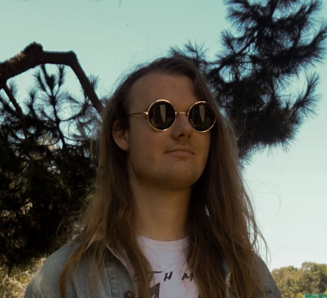

# Andrew Boyd

## Fourth Year Math and Computer Science Student

>Those who wish no change may sit hugging their scruples forever.

**Proficient in**
- C++
- C
- Java
- Python 3
- Bash

My favorite programming languages are Python 3 and C++
- [x] Helpdesk experience
- [x] QA experience
- [x] Project management experience 
```
#include <stdio.h>
int main() {
   printf("Hello everyone!");
   return 0;
}
```

This was written for Professor Thomas Powell's [Winter 2021 Software Engineering](https://courses.ucsd.edu/coursemain.aspx?section=30316/) course at UCSD.